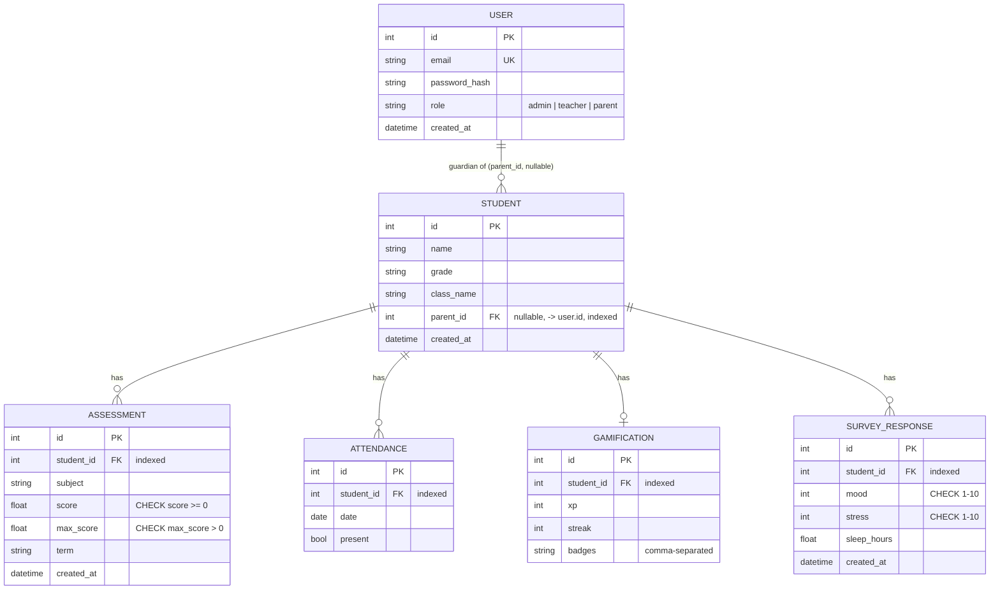
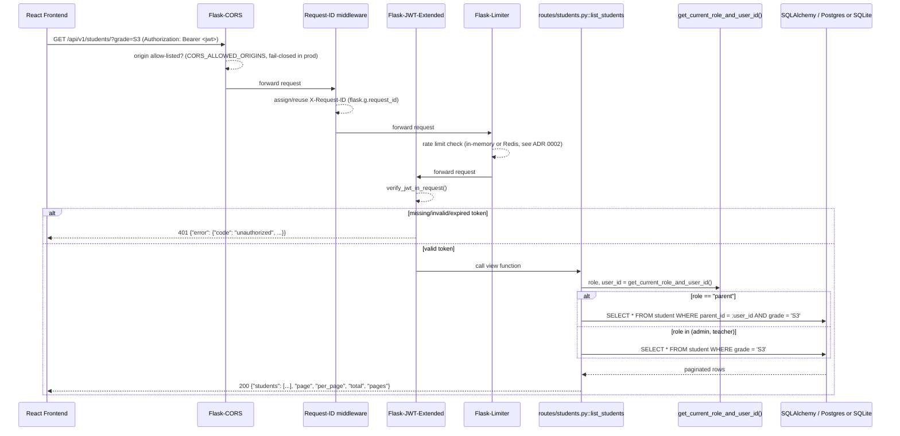
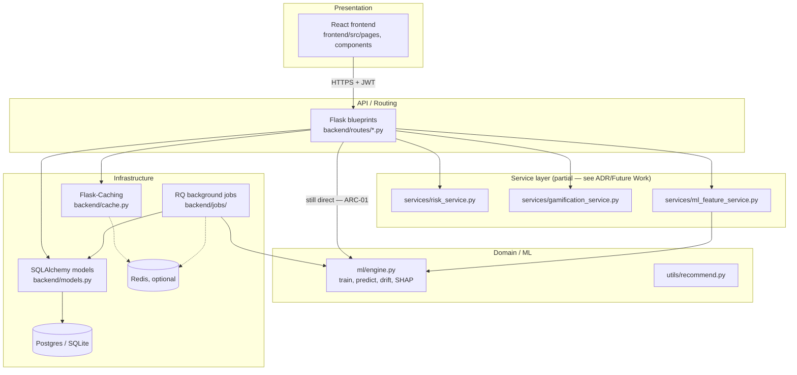

# PredictWise — Architecture

This document supplements `project.md` with the two diagrams a prior
audit specifically flagged as missing: an entity-relationship diagram and
a request-flow diagram. See `docs/adr/` for the reasoning behind specific
architectural decisions (database choice, rate-limiting backend, the
parent-ownership data model).

**On screenshots/live demo assets:** a real headless Chromium was
available in the working environment, so — unlike a live hosted
deployment, which genuinely requires infrastructure this repository
cannot provision on its own — screenshots of the actual running app
*could* be captured, and were: `docs/screenshots/login.png`,
`dashboard.png`, `students.png`, and `leaderboard.png` were taken against
a real `flask db upgrade` + `python -m backend.seed`-seeded backend and a
production frontend build, logged in as the seeded admin account, using
real in-app navigation (not a mock). A live *hosted* URL and a demo video
remain genuinely out of reach (no hosting account/browser-facing network
access), and are not claimed here.

Capturing these screenshots for real — rather than skipping this section
— surfaced four genuine, previously-undiscovered bugs that unit/
integration tests alone had not caught, because none of them exercise a
production frontend build against a running backend end-to-end:

1. **`python -m backend.app` crashed immediately** with `NameError:
   name '_configure_logging' is not defined`. `_configure_logging`/
   `_setup_signals` were defined *after* the `if __name__ == '__main__':`
   block that calls them — harmless for every other entry point (pytest's
   `create_app()` calls, `flask run`, `gunicorn wsgi:application`), all of
   which import the module without ever executing that block, but fatal
   for the exact command `project.md`'s own "Local Setup" section
   recommends. Fixed by moving the block to the end of `backend/app.py`.
2. **`VITE_API_BASE` never actually applied in a production build.**
   `frontend/src/api.js` read it as `import.meta?.env?.VITE_API_BASE` —
   the optional chaining prevented Vite's static replacement of
   `import.meta.env.X` reads from recognizing the pattern, so the
   configured value was silently dropped and the `'/api/v1'` fallback
   always won, regardless of configuration. Confirmed by inspecting the
   built bundle before and after removing the optional chaining.
3. **The header's Online/Offline indicator was permanently broken.**
   `components/Connectivity.jsx` called `api.get('/health')` through the
   `/api/v1`-prefixed axios client, but `backend/app.py` registers
   `/health` at the application root, unprefixed — every health check
   silently 404'd, so the indicator reported "Offline" 100% of the time
   regardless of actual backend status. Fixed by adding a
   `checkHealth()` export in `api.js` that derives the correct root URL.
4. **Every seeded demo account was unable to log in.** `backend/seed.py`
   generated accounts on `@predictwise.test`, but `.test` is an IANA/RFC
   2606 reserved special-use TLD that pydantic's `EmailStr` rejects as a
   syntax-level validation failure — the accounts existed in the
   database (the ORM has no email-format validation of its own) but could
   never authenticate through the real `/api/v1/auth/login` endpoint.
   Fixed by switching to `@predictwise.rw` (Rwanda's real ccTLD, fitting
   this project's own framing), with a regression test
   (`test_seed.py`) validating every seeded email pattern through the
   same pydantic schema the login route uses.

All four are fixed in the current code and covered by tests where an
automated test was feasible (`test_seed.py` for #4); #1-#3 were verified
by actually re-running the fixed commands/flows, documented above rather
than only asserted.

## Entity-Relationship Diagram

Notes on what this diagram makes explicit that the migration files alone
don't:

- `STUDENT.parent_id` is the guardian-ownership relationship added in
  response to the audit's privacy finding (see ADR 0003). It is nullable
  and one-directional (one parent per student) — see the ADR for why a
  many-to-many guardian model was considered and deferred.
- The `CHECK` constraints on `ASSESSMENT.score`/`max_score` and
  `SURVEY_RESPONSE.mood`/`stress` are enforced at the database layer
  (migration `b191955c3583`), not only by the pydantic schemas at the API
  boundary — a direct ORM write (e.g. from `seed.py` or a future script)
  cannot violate these bounds either.
- Every `student_id` foreign key is indexed (same migration), since it is
  the join/filter column for every per-student query in the codebase.

## Request Flow

The diagram below traces a single representative request —
`GET /api/v1/students/` — through every layer it passes: CORS, request-ID
assignment, JWT authentication, the (not present, for this route) RBAC
gate, parent-ownership scoping, and the database.

For a sensitive, RBAC-gated action (e.g. `POST /api/v1/ml/train`), the
same pipeline additionally passes through `roles_required('admin')`
between JWT verification and the route body, which both enforces the role
check and emits a structured audit log line
(`utils/audit.py::log_audit_event`) on every denial and every successful
admin action — see `docs/adr/` and `utils/auth.py`'s module docstring for
why this is a decorator rather than an inline check repeated per route.

When `REDIS_URL` is configured, `POST /api/v1/ml/train` additionally
branches: instead of running `GridSearchCV` inline in the request thread,
it enqueues a job onto an RQ queue and returns `202 {"job_id", "status":
"queued"}` immediately; `GET /api/v1/ml/train/status/<job_id>` polls the
same Redis-backed queue for the job's current status and result. See
`backend/jobs/` and ADR 0002.

## Layering (current state, and where the audit's ARC-01 finding still applies)

The dotted/annotated edge (`Routes -->|"still direct"| Engine`) is
deliberate: this pass extracted three genuinely reusable, unit-tested
service modules (risk classification, gamification math, ML
feature-engineering — see `backend/services/` and their corresponding
pure-unit test files with no Flask/DB dependency), but did **not**
attempt a full layered rewrite of `ml/engine.py` itself, which still
mixes model training, persistence, heuristic fallback, and drift
computation in one module. A complete Presentation → Service → Domain →
Infrastructure layering (with `ml/engine.py`'s internals split into
dedicated training/prediction/drift services) is listed as the natural
next step in `project.md`'s "Future Work", not claimed as done here.
